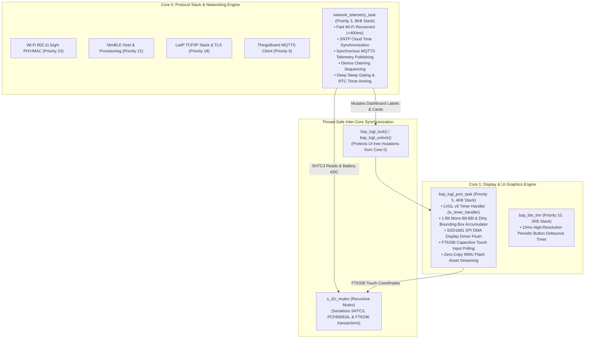

# System Architecture & Multi-Threaded Runtime Specification

**Project:** ESP32-S3 Touch ePaper BSP & Telemetry Node  
**Hardware Target:** Waveshare ESP32-S3-Touch-ePaper-1.54 V2 (`ESP32-S3-PICO-1-N8R8`)  
**Firmware Framework:** ESP-IDF v5.1 / v6.1 (C / C++20) with FreeRTOS SMP  
**Display Engine:** LVGL v9.6.0 (Debloated 1-Bit Monochrome SSD1681 Pipeline)  

---

## 1. System Architectural Layers

The architecture enforces a strict three-tier boundary ensuring modularity, thread safety, and clean separation between hardware abstraction and application business logic:

```mermaid
graph TD
    subgraph APP_LAYER ["Application Layer (examples/Unified_BSP_Demo/main)"]
        MAIN["main.cpp (State Machine & UI Lifecycle)"]
        APP_MQTT["app_mqtt.c (ThingsBoard MQTTS Client & Attributes)"]
        APP_BLE["app_ble_prov.c (NimBLE GATT Provisioning Manager)"]
        APP_TIME["app_time_sync.c (SNTP Network Time to PCF85063A Sync)"]
        APP_CLAIM["app_claiming.c (RNG Claiming Key Generator)"]
    end

    subgraph BSP_LAYER ["Board Support Package (components/esp32-s3_bsp)"]
        BSP_COMMON["bsp_common.c (Master Init & Centralized IO Latch)"]
        BSP_POWER["bsp_power.c (Battery ADC, Power Latch, Deep Sleep Gating)"]
        BSP_DISPLAY["bsp_display.cpp (SSD1681 SPI DMA & Custom Partial LUTs)"]
        BSP_LVGL["bsp_lvgl.cpp (LVGL v9 Port, FreeRTOS Task & Mutex Guard)"]
        BSP_TOUCH["bsp_touch.cpp (FT6336 Capacitive Touch I2C Driver)"]
        BSP_SENSORS["bsp_sensors.c (Sensirion SHTC3 Temp/Humidity Driver)"]
        BSP_RTC["bsp_rtc.c (NXP PCF85063A RTC, 1Hz Timer, Alarms & Drift Offset)"]
        BSP_AUDIO["bsp_audio.c (ES8311 Codec & NS4168 Class-D Amp Control)"]
        BSP_WIFI["bsp_wifi.c (Fast RTC Cache Reconnect <400ms & NVS)"]
        BSP_BUTTON["bsp_button.c (10ms Debounce & Click/Hold State Machine)"]
        BSP_ASSETS["bsp_assets.c (Zero-Copy Flash MMU 1-Bit Asset Decoder)"]
    end

    subgraph HW_LAYER ["Physical Hardware Subsystems"]
        ESP32S3["ESP32-S3-PICO-1 (240MHz Dual LX7, 8MB Flash, 8MB PSRAM)"]
        EPD_PANEL["1.54\" 200x200 Mono e-Paper Display (SSD1681)"]
        I2C_BUS["Shared I2C Bus (SHTC3, PCF85063A, FT6336, ES8311)"]
        AUDIO_AMP["NS4168 Power Amp & Speaker"]
        BATTERY["400mAh LiPo Cell & Power Hold Circuit"]
    end

    APP_LAYER --> BSP_LAYER
    BSP_LAYER --> HW_LAYER
```

---

## 2. Dual-Core Task & Multi-Threading Orchestration

To eliminate UI lag, audio distortion, and network render tearing, execution is split across the ESP32-S3's dual 240MHz Xtensa LX7 cores:



### Task Hierarchy & Resource Allocation

| Core | Task Name | Priority | Stack Size | Primary Execution Function |
| :--- | :--- | :--- | :--- | :--- |
| **Core 0** | `wifi` | 23 | System | Hardware Wi-Fi MAC/PHY interrupt handler |
| **Core 0** | `nimble_host` | 21 | System | Bluetooth Low Energy GATT service & bonding |
| **Core 0** | `tcpip` | 18 | System | LwIP TCP/IP packet routing, DHCP, & mbedTLS |
| **Core 0** | `mqtt_task` | 5 | 6 KB | Secure MQTTS transport loop & telemetry ACKs |
| **Core 0** | `net_telemetry` | 3 | 8 KB | Main lifecycle, Wi-Fi reconnection, SNTP, sensor sampling, and deep sleep orchestration |
| **Core 1** | `bsp_lvgl_task` | 5 | 4 KB | LVGL v9 UI render loop, partial differential refresh LUTs, and touch input |
| **Core 1** | `bsp_btn_tmr` | 10 | 2 KB | 10ms periodic debounce timer & multi-click detection |

---

## 3. Hardware Bus & Electrical Pinout Matrix

All GPIO lines are initialized and latched in [`bsp_init_io()`](file:///c:/Users/Matt/Documents/GitHub/esp32-s3_bsp/components/esp32-s3_bsp/src/bsp_common.c#L24-L85) before peripheral drivers start:

| GPIO | Signal Name | Peripheral Subsystem | Electrical Polarity & Mode | Configured Default State |
|---|---|---|---|---|
| **GPIO 17** | `BAT_Control` | Power Management | **Active HIGH** (1 = Latch Power ON, 0 = Drop Rail) | `1` (Latched ON at boot + `gpio_deep_sleep_hold_en`) |
| **GPIO 6** | `EPD3V3_EN` | 1.54″ e-Paper Display | **Active LOW** (0 = Power ON, 1 = Cut Power Rail) | `0` (Power ON during runtime; `1` held in deep sleep) |
| **GPIO 42** | `PA_EN` | NS4168 Audio Amp | **Active LOW** (0 = Power ON, 1 = Cut Power Rail) | `1` (Cut by default to eliminate pops; `0` on playback) |
| **GPIO 46** | `PA_CTRL` | NS4168 Audio Amp | **Active HIGH** (1 = Enabled, 0 = Standby) | Managed via ES8311 codec driver interface |
| **GPIO 3** | `LED_GREEN` | User Status LED | **Open-Drain, Active LOW** (0 = ON, 1 = OFF) | `1` (OFF; driven low via `bsp_led_set(true)`) |
| **GPIO 0** | `BOOT0` | Tactile Boot Button | **Active LOW** (0 = Pressed, 1 = Idle) | `INPUT_PULLUP` enabled |
| **GPIO 18** | `BAT_KEY` | Hardware Power Button | **Active LOW** (0 = Pressed, 1 = Idle) | `INPUT_PULLUP` enabled |
| **GPIO 5** | `RTC_INT` | PCF85063A RTC INT | **Active LOW, Open-Drain** (No PCB pull-up) | `INPUT_PULLUP` enabled on ESP32-S3 internal pull-up |
| **GPIO 7** | `EPD_TP_RST` | FT6336 Touch Panel | **Active LOW** (0 = Reset, 1 = Run) | `1` (Not in reset) |
| **GPIO 21** | `EPD_TP_INT` | FT6336 Touch Panel | **Active LOW** (0 = Touch Interrupt) | `INPUT_PULLUP` enabled |
| **GPIO 4** | `BAT_ADC` | Battery ADC Monitor | ADC1 Channel 3 (0–3.1V linear curve) | Measured through 100kΩ/100kΩ divider ($V_{BAT} = 2.0 \cdot V_{ADC}$) |
| **GPIO 47 / 48** | `SDA / SCL` | Shared I2C0 Bus | Open-Drain @ 400 kHz (Fast Mode) | External 4.7kΩ pull-ups present on PCB |
| **GPIO 11–13, 8–10**| `EPD SPI` | SSD1681 SPI Display | SPI2 Master (20MHz) + CS, DC, RST, BUSY | Full/Partial OTP waveform management |
| **GPIO 14–16, 38, 45**| `I2S0` | ES8311 Codec Audio | Standard Mono Left-Slot (16kHz 16-bit PCM) | Low-power master clocking |

---

## 4. Power Management & Deep Sleep Gating Cycle

To maximize runtime on the **400mAh LiPo cell**, the system spends >95% of its lifespan in ultra-low power deep sleep:

```mermaid
sequenceDiagram
    autonumber
    participant ESP32 as ESP32-S3 (Core 0/1)
    participant EPD as SSD1681 1.54" EPD
    participant RTC as PCF85063A External RTC
    participant NET as Wi-Fi / ThingsBoard MQTTS

    Note over ESP32,RTC: 1. Wake from Deep Sleep (EXT1 Trigger via RTC GPIO5 or BOOT GPIO0)
    ESP32->>ESP32: bsp_board_init() -> Centralized IO Latching
    ESP32->>ESP32: bsp_shtc3_read() (Sample Temperature & Humidity)
    ESP32->>ESP32: bsp_battery_get_voltage() (Read ADC1_CH3)

    par Fast Reconnect & Telemetry Publish (Core 0)
        ESP32->>NET: bsp_wifi_connect_from_nvs() (RTC Slow Mem Fast Cache &lt;400ms)
        ESP32->>NET: app_mqtt_publish_telemetry_sync() (Synchronously Awaited)
    and Update Display (Core 1)
        ESP32->>EPD: bsp_display_flush_partial_area() (Differential Bit-Blit)
    end

    Note over ESP32,EPD: 2. Deep Sleep Preparation & Executive Rail Isolation
    ESP32->>ESP32: bsp_audio_power_enable(false) (PA_EN = 1) + gpio_hold_en
    ESP32->>EPD: bsp_display_deep_sleep() (&lt;1uA sleep mode)
    ESP32->>ESP32: Cut EPD 3.3V Rail (EPD3V3_EN = 1) + gpio_hold_en
    ESP32->>ESP32: FT6336 in Reset (TOUCH_RST = 0) + gpio_hold_en
    ESP32->>RTC: bsp_rtc_set_countdown_timer(sleep_sec) (0.22uA crystal timing)
    ESP32->>ESP32: Hold BAT_Control (GPIO17 = 1) + gpio_deep_sleep_hold_en()
    ESP32->>ESP32: esp_sleep_enable_ext1_wakeup_io(GPIO 0 | GPIO 5, ANY_LOW)
    ESP32->>ESP32: esp_deep_sleep_start()
```

---

## 5. Zero-Copy LVGL v9 Graphics Pipeline

1. **Monochrome Memory Footprint**:
   - Color format is configured strictly to `LV_COLOR_FORMAT_I1` (1-bit packed, 1 byte per 8 pixels).
   - Entire 200x200 display buffer requires only **5,000 bytes** of RAM.
2. **Zero-Copy SPI Flash Asset Streaming**:
   - Static artwork (such as the shutdown screen `space_cat.bin`) is pre-compiled into an `esp_mmap_assets` flash partition.
   - The custom LVGL v9 decoder in [`bsp_assets.c`](file:///c:/Users/Matt/Documents/GitHub/esp32-s3_bsp/components/esp32-s3_bsp/src/bsp_assets.c) passes MMU flash memory pointers directly to `lv_draw_buf_t` with `dsc->args.no_cache = true`, avoiding RAM framebuffer allocation.
3. **Differential Partial Refresh Accumulator**:
   - [`bsp_lvgl.cpp`](file:///c:/Users/Matt/Documents/GitHub/esp32-s3_bsp/components/esp32-s3_bsp/src/bsp_lvgl.cpp) accumulates dirty bounding boxes across render passes, sending only the modified pixel slice to the SSD1681 differential RAM (`0x24` new RAM / `0x26` old RAM) with partial LUTs (`~0.3s` refresh) to prevent full-screen flashing.
